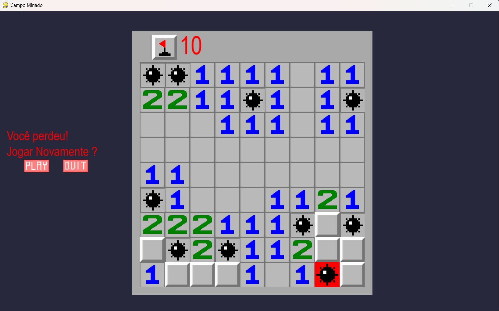

# Campo Minado



> **Descrição da imagem:**  
> A imagem é um print da janela do jogo rodando e funcionado, no exemplo o usuário explodiu uma bomba e portanto perdeu o jogo, mas caso ele queira fazer uma nova tentativa basta clicar no botão play, ou quit para fechar o jogo, a interface também oferece o recurso de bandeiras para o usuário marcar os lugares que ele acha que tem bomba, a quantidade de bandeira corresponde ao número de bombas no campo se o usuário marcar 10 bandeiras e os demais quadrados estiverem abertos significa que ele descobriu todas as bombas e ganhou, para marcar as bandeiras basta clicar com o botão esquerdo do mouse.

## Sobre

Este projeto é uma implementação do clássico jogo Campo Minado utilizando Python e Pygame. O objetivo é abrir todas as casas do tabuleiro sem explodir nenhuma mina. 
## Como executar

1. Instale as dependências:
   ```
   pip install pygame numpy
   ```
2. Execute o arquivo principal:
   ```
   python main.py
   ```

## Estrutura

- `main.py`: Arquivo principal para iniciar o jogo.
- `jogo.py`, `tabuleiro.py`: Lógica do jogo e do tabuleiro.
- `imagens/projeto.jpeg`: Imagem ilustrativa do projeto.

